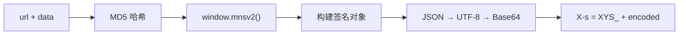

<div align="center">

# XHS Sign Service

**小红书签名服务** — 基于 Playwright 的 X-s / X-t / X-s-common 签名生成

[](https://python.org)
[](https://fastapi.tiangolo.com)
[](https://playwright.dev)
[](LICENSE)

</div>

---

## 特性

- 🌐 **多实例浏览器池** — 可配置 2~5 个 Chromium 实例，轮询负载均衡
- 🔄 **自动恢复** — 连续错误自动重载页面，无需人工干预
- 🛡️ **反检测** — 注入 stealth 脚本，隐藏自动化特征
- 🍪 **Cookie 管理** — 支持注入 / 导出浏览器 Cookie
- 🌍 **代理支持** — 完整的代理配置，支持认证

---

## 快速开始

```bash
# 1. 安装依赖
pip install playwright aiohttp fastapi uvicorn structlog pydantic pydantic-settings
playwright install chromium

# 2. 启动服务
python server.py

# 3. 登录（保存 Cookie 到 login_cookies.json）
python test_login.py
```

服务默认运行在 `http://localhost:8080`

---

## API

| 方法 | 路径 | 说明 |
|:----:|------|------|
| `POST` | `/api/sign/xys` | 生成签名 (`X-s`, `X-t`, `X-s-common`) |
| `GET` | `/api/cookies` | 获取浏览器 Cookie |
| `POST` | `/api/xsec-token` | 获取 xsec_token |
| `GET` | `/api/health` | 健康检查 |
| `GET` | `/api/stats` | 服务统计 |
| `GET` | `/api/instances` | 实例列表 |
| `POST` | `/api/instances` | 创建实例 |
| `DELETE` | `/api/instances/{id}` | 删除实例 |

<details>
<summary><b>签名请求示例</b></summary>

```bash
curl -X POST http://localhost:8080/api/sign/xys \
  -H "Content-Type: application/json" \
  -d '{"url": "/api/sns/web/v1/search/notes", "data": "{\"keyword\":\"美食\"}"}'
```

```json
{
  "code": 0,
  "data": {
    "x-s": "XYS_...",
    "x-t": "1739260000000",
    "x-s-common": "..."
  }
}
```

</details>

---

## 签名流程



---

## 配置

支持 **命令行参数**、**环境变量**（`XYS_` 前缀）和 **`.env` 文件**：

| 配置项 | 默认值 | 说明 |
|--------|:------:|------|
| `host` | `0.0.0.0` | 监听地址 |
| `port` | `8080` | 端口 |
| `min_instances` | `2` | 最小实例数 |
| `max_instances` | `5` | 最大实例数 |
| `headless` | `true` | 无头模式 |
| `sign_timeout` | `5000` | 签名超时 (ms) |
| `proxy_server` | — | 代理服务器 |
| `browser_executable` | — | 自定义浏览器路径 |

```bash
# 示例
python server.py --port 9090 --max-instances 3 --no-headless
```

---

## 测试脚本

```bash
python test_login.py                          # 登录
python test_login.py --sign-only              # 仅测试签名
python test_search.py "关键词"                 # 搜索笔记
python test_user_posted.py --user-id <用户ID>  # 获取博主笔记
```

> 搜索和博主笔记需先登录，自动从 `login_cookies.json` 加载凭证。

---

## 项目结构

```
├── server.py           # FastAPI 服务器
├── xys_manager.py      # 多实例管理器
├── xys_service.py      # 签名核心逻辑
├── xys_scripts.py      # 浏览器注入脚本
├── config.py           # 配置管理
├── exceptions.py       # 自定义异常
├── stealth.min.js      # 反检测脚本
├── test_login.py       # 登录脚本
├── test_search.py      # 搜索脚本
└── test_user_posted.py # 博主笔记脚本
```

---

## License

[MIT](LICENSE)
